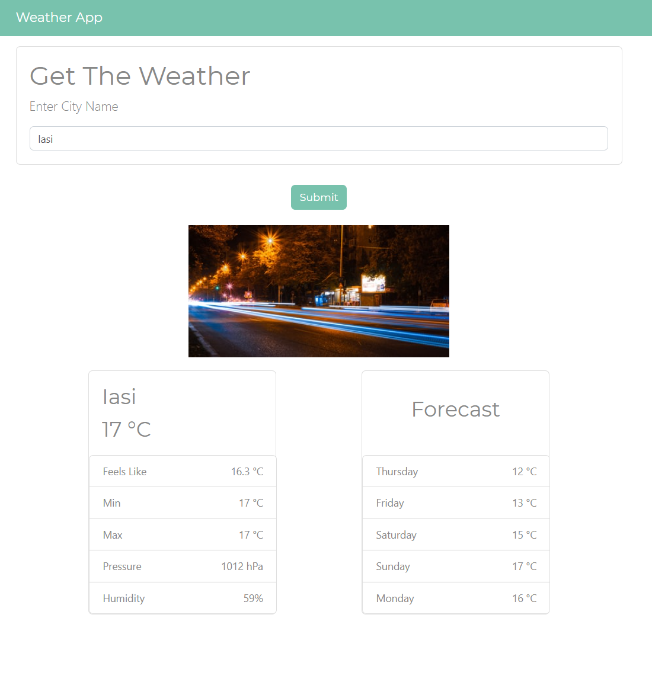

# Title: Weather App
# Website [LINK](https://antoniobaciu.github.io/WeatherApp/)

# Short introduction:
This is a simple weather application where you can check the weather 
and the forecast of a city.
All the weather data is received from an online API.

__Weather API Website:__ [OpenWeather](https://openweathermap.org/)
__Images API:__ [Unsplash](https://unsplash.com/developers)

__Features:__
- [x] Search functionality by name of city
- [x] Access API to receive and display weather data
- [x] Access API to receive and display images based on input

